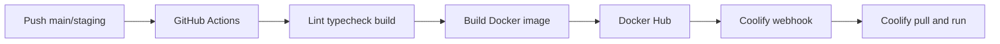

# Deploy ke Coolify (Docker Hub)

Alur deploy **lingora-fe**: GitHub Actions build image → push ke **Docker Hub** → trigger **Coolify webhook** untuk pull & redeploy.



## GitHub Secrets

Set di **Settings → Secrets and variables → Actions**:

| Secret                    | Wajib    | Keterangan                                                       |
| ------------------------- | -------- | ---------------------------------------------------------------- |
| `DOCKER_USERNAME`         | Ya       | Username Docker Hub                                              |
| `DOCKER_PASSWORD`         | Ya       | Access token Docker Hub (bukan password akun)                    |
| `COOLIFY_WEBHOOK_PROD`    | Ya       | Webhook URL deploy production (`main`)                           |
| `COOLIFY_WEBHOOK_STAGING` | Ya       | Webhook URL deploy staging (`staging`)                           |
| `COOLIFY_TOKEN`           | Opsional | Bearer token Coolify API (jika webhook/instance memerlukan auth) |
| `API_PROXY_URL_PROD`      | Ya       | Backend URL untuk build production                               |
| `API_PROXY_URL_STAGING`   | Ya       | Backend URL untuk build staging                                  |

## GitHub Environments (opsional)

Workflow memakai environment `production` (branch `main`) dan `staging` (branch `staging`) agar secrets bisa dipisah per environment di GitHub.

## Image tags di Docker Hub

| Branch    | Tags                                                                                     |
| --------- | ---------------------------------------------------------------------------------------- |
| `main`    | `{DOCKER_USERNAME}/lingora-fe:latest`, `{DOCKER_USERNAME}/lingora-fe:{git-sha}`          |
| `staging` | `{DOCKER_USERNAME}/lingora-fe:staging`, `{DOCKER_USERNAME}/lingora-fe:staging-{git-sha}` |

## Setup Coolify

Buat **dua application** (prod & staging) dengan tipe **Docker Image** (bukan build dari Git):

### Production

1. **New Resource** → **Application** → **Docker Image**
2. Image: `{DOCKER_USERNAME}/lingora-fe:latest`
3. Registry credentials: Docker Hub (`DOCKER_USERNAME` + token)
4. Port: **3626**
5. Health check path: `/`
6. Salin **Deploy Webhook URL** → paste ke secret `COOLIFY_WEBHOOK_PROD`

### Staging

1. Sama seperti production
2. Image: `{DOCKER_USERNAME}/lingora-fe:staging`
3. Webhook → secret `COOLIFY_WEBHOOK_STAGING`

> Build-time env (`API_PROXY_URL`) sudah di-bake saat CI build. Tidak perlu set ulang di Coolify kecuali image di-build ulang di server.

## Branch trigger

| Branch    | Environment | Webhook                   |
| --------- | ----------- | ------------------------- |
| `main`    | production  | `COOLIFY_WEBHOOK_PROD`    |
| `staging` | staging     | `COOLIFY_WEBHOOK_STAGING` |

PR ke `main` / `staging` hanya menjalankan CI checks (`.github/workflows/ci.yml`), tanpa push image.

## Test lokal

```bash
cp .env.example .env
docker compose up --build
# http://localhost:3626
```

Push manual ke Docker Hub (debug):

```bash
docker login
docker build \
  --build-arg API_PROXY_URL=http://host.docker.internal:4626 \
  --build-arg NEXT_PUBLIC_API_URL= \
  -t "$DOCKER_USERNAME/lingora-fe:local" .

docker push "$DOCKER_USERNAME/lingora-fe:local"
```

## Troubleshooting

- **Image tidak update di Coolify**: pastikan app pull from registry + webhook ter-trigger setelah push.
- **401 Docker Hub**: gunakan **Access Token**, bukan password akun.
- **API error setelah deploy**: cek `API_PROXY_URL_PROD` / `API_PROXY_URL_STAGING` di GitHub Secrets (di-bake saat build).
- **Webhook gagal**: coba tambahkan `COOLIFY_TOKEN` jika instance Coolify memerlukan Bearer auth.
